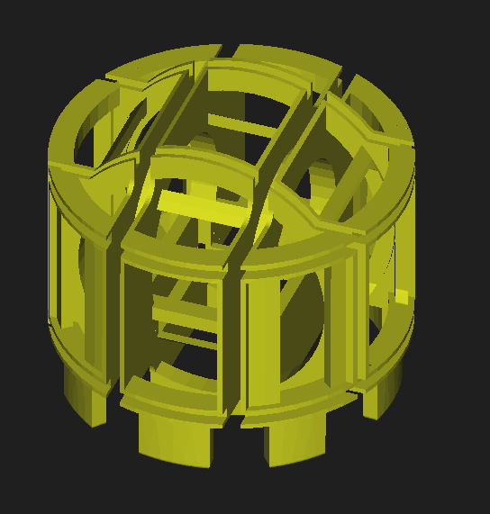

# Bench test — 3D Helmholtz fixture (lab supply only)



**Figure 1.** CAD render of the **3D-printed Helmholtz fixture**: three orthogonal coil pairs (grooved raceways for X, Y, and Z windings) integrated into one frame; the **central pocket** locates the **MT102** magnetometer at the **geometric center** (“null sphere” volume) for repeatable bench calibration.

This procedure characterizes the **3D Helmholtz fixture + 25 ft shielded harness** using a **variable lab supply** and **OWON XDM1041**, with the **Calibrator drive chassis (Pico 2 W + DRV8871) disconnected** from the coil path.

Goals:

- Record **DC voltage** and **DC current** at controlled **lab supply** settings, **one axis at a time**.
- Build a **ground-truth** table for **V, I, R** per axis (later compare to **INA3221** / **`TM::`** when the driver is back in circuit).
- Avoid **back-driving** the H-bridge (see safety below).

**Stimulus philosophy — synthesized field only:** MOPS-style exercises (e.g. heading change, **−17° dip**) are to be produced by **coil-driven B⃗** in the **fixture / sensor frame**, not by using Earth’s field as part of the **defined** test waveform. Operator alignment to **true north** is **not** assumed. Any residual ambient field is handled separately (**shielding**, **baseline capture**, and/or **electronic bias**) so the **intended** stimulus remains the **programmed synthesis**.

## Siting, ambient field, and traceability

The **~25 ft shielded coil harness** exists so the **fixture** can be placed in a **magnetically quieter** spot than the drive bench: away from **motors**, **transformers**, **switching supplies**, and heavy **bench iron**. If needed, the fixture can be sited **outdoors** (weather permitting) to reduce local AC/DC clutter—while respecting **cable strain**, **IP**, and **lightning / ESD** common sense.

**Near-term goal:** pass the **simple MOPS** magnetics exercise with **synthesized-field** control and the leveled MT102 fixture.

**Later qualification:** a **NIST-referenced magnetic field strength meter** with a **~3 m remote / isolated probe cable** can have its **probe centered in the fixture** to map or correct the **realized |B⃗|** against the host / **Pico 2 W** model (Gauss-from-mA, geometry, and non-idealities). That step is **out of scope** for the first MOPS pass but is the planned path to **system-level** field calibration.

---

## Safety and topology

| Rule | Why |
|------|-----|
| **Driver chassis not on this path** | **Lab supply + coil** must **not** share wires with **live DRV8871 outputs**. Back-drive can damage the bridge or the supply. |
| **One axis energized at a time** (recommended) | Simpler return path; avoids sneak paths through other coil pairs. |
| **DMM fuse / range** | In **DC A**, respect **jack** (mA vs 10 A) and **OWON** limits. Start **high current** range if unsure. |
| **Common return** | Lab supply **−** returns to the correct **Coil−** for that axis (see pinout). |

**Approved topology for these tests:**

```text
  Lab supply (+) ──► [optional: DMM I+ → I− for series A] ──► breakout Coil+ ──► cable ──► fixture axis (+)
  Lab supply (−) ───────────────────────────────────────────► breakout Coil− ──► cable ──► fixture axis (−)
```

For **DC voltage** checks (e.g. verify supply at breakout), move leads to **VΩ** jacks and measure in parallel with the **axis pair** (or supply output), **not** in series.

---

## Reference — 6-pin harness (driver chassis naming)

From **`3D_WIRING.md`**:

| Pin | Color | Signal |
|-----|--------|--------|
| 1 | Red | X Coil+ |
| 2 | Black | X Coil− |
| 3 | White | Y Coil+ |
| 4 | Yellow | Y Coil− |
| 5 | Green | Z Coil+ |
| 6 | Blue | Z Coil− |

**Cable:** UL2464 **22 AWG 6C shielded**, **25 ft** (tinned copper). Expect **~0.7–1.0 Ω** round-trip copper **in addition** to coil DC resistance when measuring **at the breakout** (pins **+** to **−**).

**Example DMM resistance (at breakout, prior session):**

| Pair | R (Ω) |
|------|--------|
| 1–2 (X) | ~12.53 |
| 3–4 (Y) | ~11.98 |
| 5–6 (Z) | ~14.6 |

**DC resistance for host `I ≈ |V|/R` (CalibratorUI.ini `[helmholtz]` `x_r_ohm` / `y_r_ohm` / `z_r_ohm`)**  
**Interim (2026):** same as the breakout DMM example above — includes harness, connector, and typical lead loss. **Replace** when you have four-wire / mΩ-grade numbers at the same reference plane.

| Pair | R (Ω) | Note |
|------|-------|------|
| 1–2 (X) | 12.53 | Breakout 1–2, prior session |
| 3–4 (Y) | 11.98 | Breakout 3–4 |
| 5–6 (Z) | 14.6 | Breakout 5–6 |

Use **fresh** numbers each session; keep conditions (temperature, which end measured) consistent.

---

## Equipment

- Variable **DC lab supply** (current limit set conservatively).
- **Breakout / enclosure** with **6-pin** passthrough and **banana** access for **Coil±** (your printed design).
- **XDM1041** + USB to PC (**COM port** — e.g. **COM4**).
- Repo **`.venv`** with **pyserial** (see `Software/HostApp/requirements.txt`).
- Optional: second notebook column for **supply front-panel V/I** readout.

---

## XDM1041 — volts vs amps (lead change)

The meter can do **`dc_volts`** and **`dc_current`** over SCPI, but **physical jacks** differ:

- **Voltage / Ω:** **VΩ** (and common) jacks.
- **Current:** **A / mA** jacks.

Whenever you switch modes in software **or** in the logging script, **move the leads**, then confirm on the meter face before logging.

**Tip:** For long **measurement runs**, leave the meter in **DC A** in series and use the **supply’s display** for **voltage**; only switch to **DC V** on the DMM for occasional spot checks.

---

## Scripts (this repo)

| Script | Purpose |
|--------|--------|
| **`Software/Tools/xdm1041/timed_lead_demo.py`** | Quick **COM / SCPI** sanity (OPEN → SHORT → AAA). |
| **`Software/Tools/xdm1041/bench_3dhc_log.py`** | **Interactive CSV log** for tomorrow: note + mode + repeated `MEAS1?`. |
| **`Software/Tools/xdm1041/dmm_cli.py`** | One-shot **`*IDN?`** + configure + single reading. |

### Run the bench logger

```powershell
cd D:\Calibrator\CoilDriver\Software\Tools\xdm1041
D:\Calibrator\CoilDriver\.venv\Scripts\python.exe bench_3dhc_log.py --port COM4
```

Optional:

```text
--out D:\Calibrator\CoilDriver\Hardware\bench_logs\my_run.csv
--debug
```

**Close the XDM1041 Qt GUI** (or anything else) that might hold **COM4** before running.

### Logger behaviour

1. Prompts for a **note** (e.g. `X axis Vlab=6.0 series_DMM_A`).
2. Asks **mode**: `dc_current` or `dc_volts`.
3. If **mode changed** since the last row, prints a **lead-change reminder** and waits for **Enter**.
4. Asks **sample count** and **interval**.
5. Waits for **Enter** after you set the supply / wiring.
6. Writes one **CSV row** with UTC time, note, mode, mean, population stdev, and raw `MEAS1?` strings.

Default output directory: **`Hardware/bench_logs/`** (auto-created).

### CSV columns

| Column | Meaning |
|--------|--------|
| `utc_iso` | Timestamp (UTC). |
| `note` | Your free-text label. |
| `mode_id` | `dc_volts` or `dc_current`. |
| `n_samples` | How many `MEAS1?` reads. |
| `interval_s` | Delay between reads. |
| `mean` | Mean of parsed floats. |
| `stdev` | Population stdev (0 if n=1). |
| `raw_samples` | Pipe-separated raw strings from the meter. |

---

## Suggested measurement order (tomorrow)

1. **Resistance** (DMM in **Ω**, leads on **VΩ** jacks): each axis **+ to −** at breakout; record in notebook (logger is for **V/A** modes; you can still type a note and use `ohms` if we extend script later — today use handheld / meter front panel for Ω if easier).
2. **DC current in steps (one axis):** lab supply from **low to high** in steps; at each step log **`dc_current`** with a note `axis=X V_supply_reading=…`.
3. **Optional DCV:** verify voltage at breakout or across coil pair with **`dc_volts`**.
4. **Repeat** for **Y**, then **Z** (only one axis connected to the supply at a time).

---

## Recorded results — lab supply direct to coils (2026-04-11)

Coils driven **directly** from the benchtop PSU (Calibrator **Pico 2 W + DRV8871 not** in the current path). **One axis at a time** at **3.0 V**. Compass used to confirm that the dominant field aligns with the energized axis.

| Axis | V (lab) | I (A) | R ≈ V/I (Ω) | Compass |
|------|---------|-------|-------------|---------|
| X | 3.0 | 0.233 | ~12.9 | Needle aligns with **X** |
| Y | 3.0 | 0.246 | ~12.2 | Needle swings to align with **Y** |
| Z | 3.0 | 0.199 | ~15.1 | Needle aligns with **Z** |

**Notes**

- X and Y are within a few percent of each other; Z shows higher DC resistance (same trend as the breakout Ω spot-checks in the table above).
- At 3 V, sustained power is about **0.6–0.74 W** per axis — watch coil temperature if you dwell at one setting.
- Driver-in-circuit tests will not match these numbers unless you measure **at the coil**; expect additional drops in FETs, shunt, and harness.

---

## Next steps — bench test with coil driver

Use this document as the running anchor: add **new dated subsections** here and/or CSV paths under **`Hardware/bench_logs/`** when you log with **`bench_3dhc_log.py`**.

1. Reconnect the **drive chassis** per **`COIL_DRIVER.md`** / **`Hardware/COIL_DRIVER_SCHEMATIC.md`**. Start with **one axis** and conservative **current limit**.
2. At comparable operating points (target coil current or measured coil voltage), log **INA3221** / host **`TM::`** readings and compare to the **lab-supply-only** table above — that is the ground truth for **`INA3221_CURRENT_SCALE`** / **`INA3221_SHUNT_OHMS`** in `Software/Pico/config.py` (and `DEPLOY/`) for the **Pico 2 W** firmware bundle.
3. Optional: repeat the **compass spot-check** with driver excitation (same “one axis at a time” discipline) to confirm polarity and routing after reassembly.

---

## After the bench

- Compare **I_measured** vs **V / R** from your resistance table (expect **I ≈ V / R_total** for DC steady state).
- When the **Pico 2 W driver** is reconnected, use the same notes to tune **`INA3221_CURRENT_SCALE`** / **`INA3221_SHUNT_OHMS`** in `Software/Pico/config.py` (and `DEPLOY/`).

---

## Related docs

- **`3D_WIRING.md`** — pin / color table.
- **`COIL_DRIVER.md`** — full drive and sense topology (for when the driver is in-circuit).
- **`Software/Tools/xdm1041/README.md`** — headless XDM1041 client and upstream **XDM1041-GUI** link.
