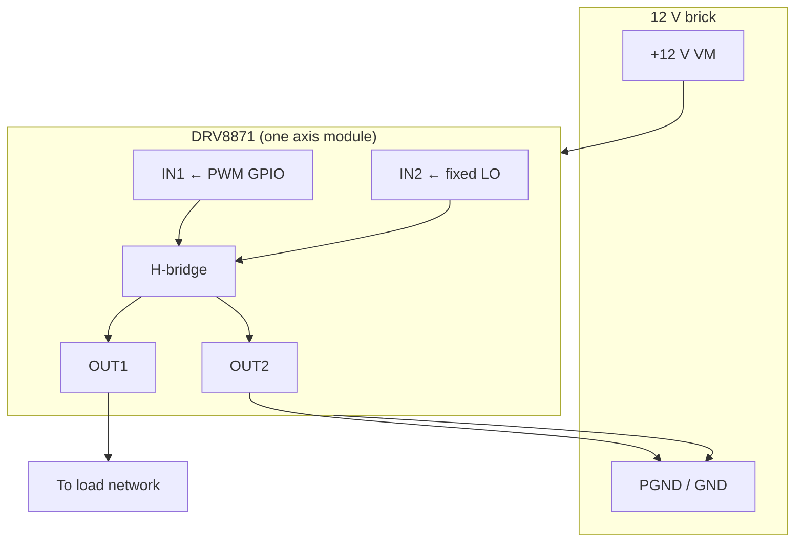
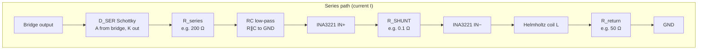
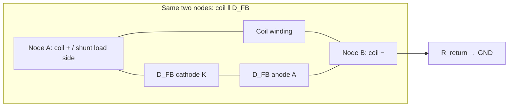
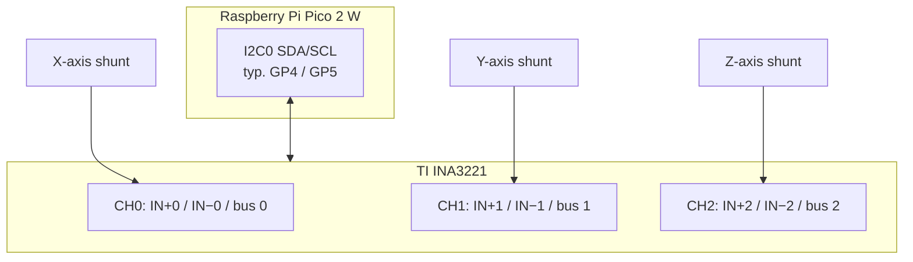
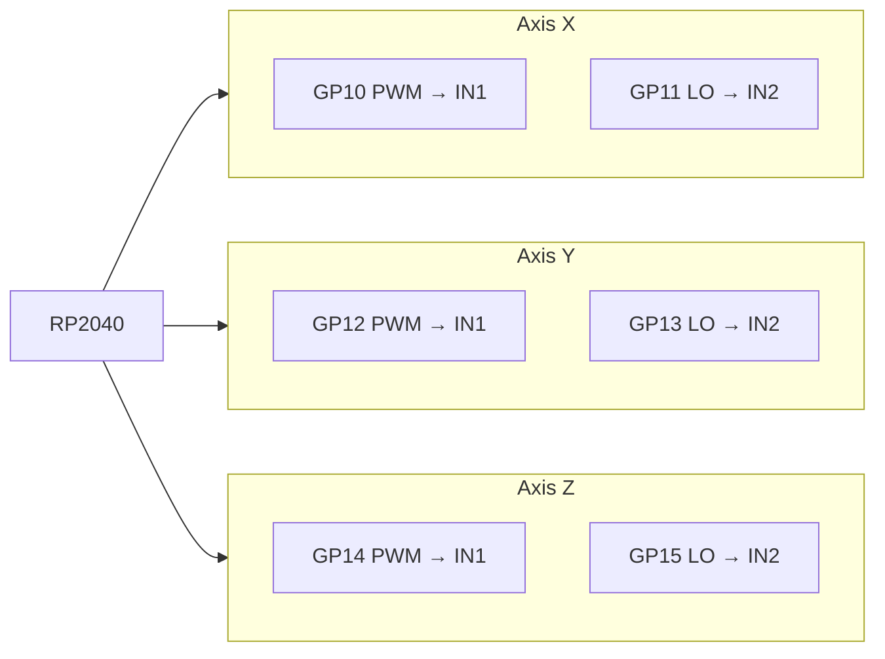
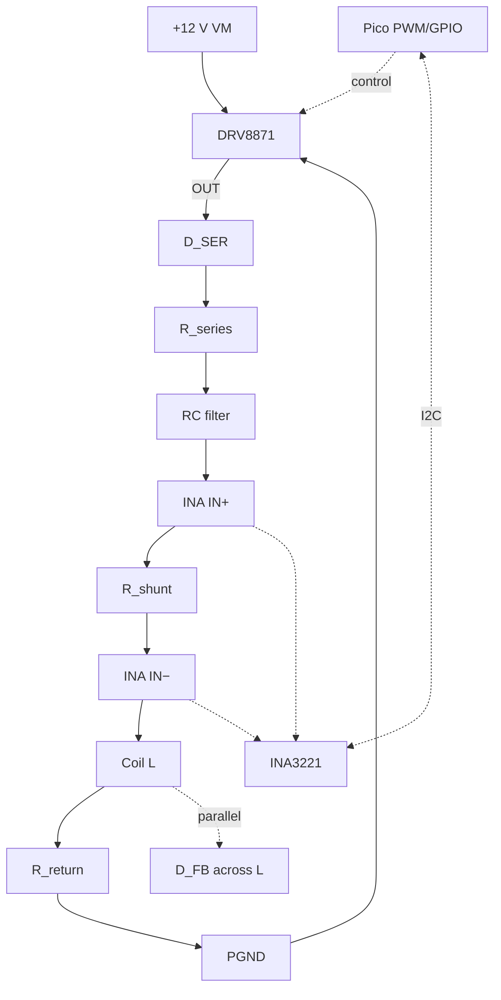

# Coil driver — Mermaid review diagrams

Open this file in Cursor / VS Code and use **Markdown: Open Preview** (`Ctrl+Shift+V`) to render Mermaid.  
Requires the **Markdown Preview Mermaid Support** extension (`bierner.markdown-mermaid`), listed in `.vscode/extensions.json`.

These are **block diagrams** for design review, not a formal netlist. Values (e.g. **200 Ω**, **50 Ω**) are placeholders — match your BOM.

---

## Power and one DRV8871 (unipolar-style control)

*Wiring of OUT1/OUT2 to load depends on your breakout — some tie one output to PGND.*

---

## Per-axis analog path (COIL_DRIVER order + your D_SER / D_FB)

---

## Flyback diode across coil (parallel branch)

Mermaid has no true “two-terminal in parallel” primitive; treat this as a **wiring intent** sketch.

*Polarity must match DC direction: **K** toward the more positive coil terminal, **A** toward the return side so freewheel current circulates when the bridge stops sourcing.*

---

## INA3221 — three channels on one I²C device

---

## Pico ↔ DRV8871 GPIO (default `config.py`)

---

## Full axis — single diagram (conceptual)

